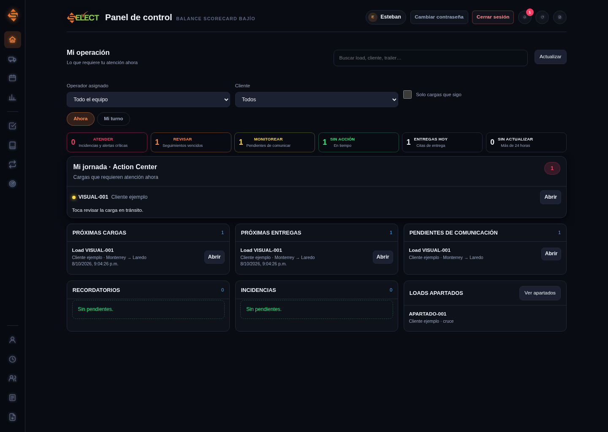
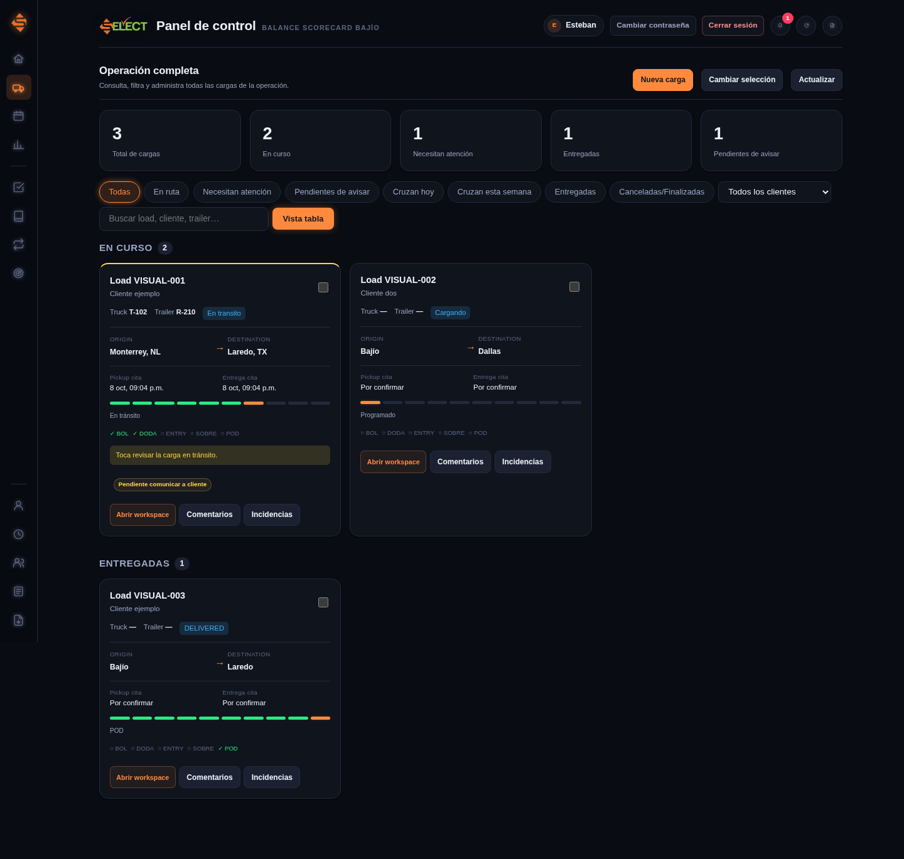

# Actualizar el sitio completo en el mismo enlace de Google

Supabase conserva los datos y las cuentas. Google Apps Script publica la página y presta el servicio de mapas. Esta entrega reúne los módulos; las pruebas manuales se hacen después de instalarla, una por una, como solicitó el usuario.

## Diseño original recuperado

La entrega usa el logo y los estilos del panel original: barra lateral, Inicio «Mi operación», pestañas Ahora/Mi turno, tarjetas y tabla en Operación completa, calendario semanal y expediente lateral con Operación, Tracking, Comunicación, Documentos, Incidencias e Historial. Los módulos nuevos siguen usando Supabase. Las fuentes están separadas por función y tienen comentarios explicativos en español; el HTML entregado conserva el código legible.

Vista previa con datos ficticios:

La corrección de incidencias requiere actualizar tanto la página como SQL: la categoría se valida antes de enviar y Supabase rechaza registros nuevos con categoría vacía. Las incidencias antiguas se conservan. No inventamos una categoría ni eliminamos lo ya guardado.

Si ya instalaste la entrega completa con Bitácora y Radar, puedes ejecutar solo [SQL 008](https://raw.githubusercontent.com/stebanrh-bit/Panel_bajio_supabase_gpt/supabase-inicial/supabase/migrations/008_incident_category_validation.sql), reemplazar `index.html` y publicar una nueva versión. `Code-sitio.gs` no cambió en esta actualización visual. Si no estás seguro de tu versión, sigue los tres pasos de abajo: el SQL completo se puede repetir y conserva tus datos.

## Los tres archivos que necesitas

Abre los enlaces y usa **Ctrl+A → Ctrl+C** para copiar todo. No necesitas descargar un ZIP.

1. [Actualización SQL completa](https://raw.githubusercontent.com/stebanrh-bit/Panel_bajio_supabase_gpt/supabase-inicial/supabase/actualizar_sitio.sql).
2. [Código Google completo](https://raw.githubusercontent.com/stebanrh-bit/Panel_bajio_supabase_gpt/supabase-inicial/google-apps-script/Code-sitio.gs).
3. [Página completa](https://raw.githubusercontent.com/stebanrh-bit/Panel_bajio_supabase_gpt/supabase-inicial/google-apps-script/index-sitio.html).

## Paso 1: actualizar Supabase

1. Abre el Dashboard de Supabase y entra en **Panel Bajio - supabase**.
2. En **SQL Editor**, pulsa **New query**.
3. Abre el primer enlace de arriba, selecciona **todo** y cópialo. Incluye desde el primer comentario hasta el último `commit;`. No copies una línea suelta.
4. Pégalo en la consulta nueva y pulsa **Run**.
5. Continúa cuando Supabase muestre el resultado satisfactorio. Si aparece un error, conserva la versión de Google que ya funciona y comparte el texto del error, sin contraseñas.

El archivo reúne SQL 004, 005, 006, 007 y 008 en una sola transacción. Requiere las actualizaciones 001, 002 y 003 que ya se usaron en tu panel. Agrega módulos y ajusta permisos; conserva las cargas, los usuarios y los expedientes. No vuelvas a ejecutar SQL 001 ni elimines tablas. La actualización se puede repetir si hace falta; un error revierte el conjunto.

## Paso 2: actualizar el código en Google

1. Abre **script.google.com** y entra al proyecto del panel que ya publicaste.
2. En el editor, abre **Code.gs**. Selecciona su contenido y pega **todo** el segundo archivo: `Code-sitio.gs`. En Google el nombre sigue siendo **Code.gs**.
3. Abre el archivo **index.html** del mismo proyecto. Selecciona su contenido y pega **todo** el tercer archivo: `index-sitio.html`. En Google el nombre sigue siendo **index**.
4. Guarda ambos archivos. No copies el antiguo `Code.gs` de la raíz de GitHub; ese pertenece a la versión basada en Google Sheets.

La página ya incluye los estilos, las bibliotecas y la configuración pública de tu Supabase. No necesitas pegar claves adicionales ni crear una hoja. Las nuevas cuentas se crean en **Supabase → Authentication → Users**; después asignas su rol en **Gestionar CSR y clientes**. Las contraseñas se administran con Supabase Auth.

## Paso 3: activar la misma implementación

1. Pulsa **Implementar → Administrar implementaciones**.
2. Selecciona la aplicación web del panel y pulsa el **lápiz**.
3. En **Versión**, selecciona **Nueva versión**.
4. Conserva **Ejecutar como: Yo** y el acceso con el que ya publicaste el login.
5. Pulsa **Implementar**. Si Google pide autorización para las consultas de mapas y Supabase, complétala desde tu cuenta.
6. Abre tu enlace habitual que termina en **/exec** y actualiza la página.

Actualizar esta implementación conserva tu enlace. No se usa Netlify. El sitio publicado no depende de mantener abierta una tarea de Codex.

Si Google pide autorización al consultar mapas y no muestra el diálogo en la página, en el editor selecciona `autorizarServiciosGoogle_`, pulsa **Ejecutar**, completa la autorización y vuelve a la página. Esta función únicamente comprueba el acceso de Google a la URL pública de Supabase.

## Paso 4: pruebas finales acompañadas

Usaremos [PRUEBAS_FINALES.md](PRUEBAS_FINALES.md). No necesitas ejecutar toda la lista de golpe. Primero comprobaremos acceso y navegación; después avanzaremos de una prueba a la siguiente. Las pruebas entre cuentas se dejan para la última etapa porque actualmente solo tienes tu cuenta.

## Qué incluye y qué requiere configuración externa

Incluye cargas y documentos, comentarios/incidencias, revisión/avisos, solicitudes pendientes, apartados, equipo/clientes/seguimiento, turnos/cierres, plantillas/cuenta, jornada, calendario, indicadores, importación con vista previa/deshacer, archivo/restauración, respaldo JSON, radar compartido y portal de clientes. Administración tiene escritura ampliada; operadores tienen sus permisos operativos; gerencia consulta; cada cliente ve únicamente el cliente que se le asignó en su portal.

- Los avisos de WhatsApp/correo se redactan y registran; el panel no envía automáticamente esos mensajes. **Publicar en portal** sí agrega el texto al portal autorizado.
- El radar usa el servicio Maps incluido en Apps Script, sujeto a sus cuotas. Línea recta y carretera están identificadas por separado. Los tiempos de ruta son estimaciones de Google, no un compromiso de llegada ni un cálculo de horas de servicio.
- Los archivos aceptados son `.xlsx` y `.csv`, hasta 1000 cargas y 10 MB. Convierte `.xls` a `.xlsx`. Las horas sin zona se interpretan en la zona que muestra el formulario; para evitar ambigüedad, usa ISO con zona en CSV. Guarda números con ceros iniciales como texto en Excel.
- Archivar cierres antiguos y descargar respaldos se ejecuta desde botones de administración. Esta entrega no instala tareas programadas ni integraciones con TCI u otros sistemas externos: requieren definir el servicio, sus permisos y la programación.
- El JSON contiene datos de la aplicación, incluido su historial; no es un respaldo de Supabase Auth ni tiene restauración automática. La exportación lee páginas sucesivas: realiza una copia fuera del turno de edición. Conserva también los respaldos de tu proyecto disponibles en Supabase.
- Las pruebas locales verifican PostgreSQL y reglas con identidades simuladas, e interfaz con DOM simulado. El iframe, Supabase Auth, la autorización de Google y las cuotas de mapas se comprobarán en la página real. La entrega nueva está preparada; solo se activa al ejecutar SQL y publicar la nueva versión.
